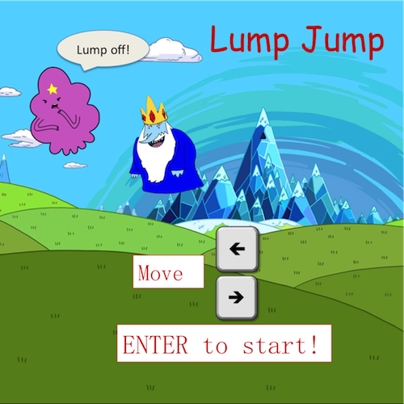
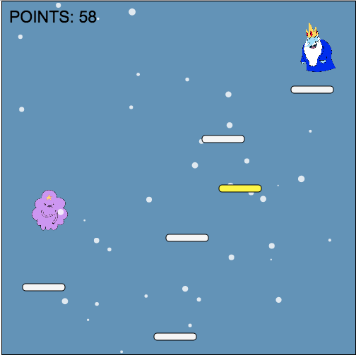
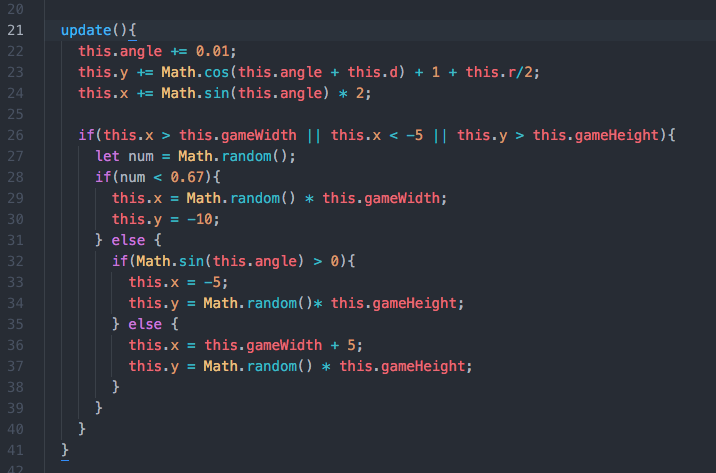

# LumpJump

## Background

LumpJump is a clone of doodlejump employing characters from the show Adventure Time. The game is written with JavaScript, HTML5-Canvas, and CSS. The goal of the game is for the main character (lumpy princess) to jump as high as possible. The game is over once the main character dies.

## Gameplay

* Use the left and right arrow keys to move the character
* Jumping on yellow platforms temporarily boost jumping speed of character
* Platforms with alternating white and transparent colors disappear upon one contact with character
* Jumping on blue monster temporarily boosts jumping jump speed
* Contacts with blue monster from the sides or bottom results in death of character
* Falling to the bottom of the screen results in death of character

## Technical Details
* Mimicked natural snow movements in game background by using sine and cosine functions to model wind directions.

## To-dos/future features

* Include rockets that transport character to higher levels
* Enable character to shoot at monsters
